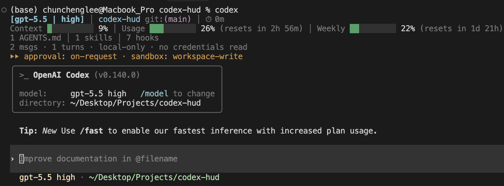

# codex-hud-dashboard

[](https://www.npmjs.com/package/codex-hud-dashboard)
[](https://github.com/calvinlee326/codex-hud/actions/workflows/ci.yml)
[](LICENSE)
[](https://nodejs.org)

A safe, local-first terminal **HUD and usage dashboard for the OpenAI Codex
CLI**. The HUD layout and design are inspired by
[claude-hud](https://github.com/jarrodwatts/claude-hud) by
[Jarrod Watts](https://github.com/jarrodwatts), reimagined for Codex. Built for
the easiest possible Codex experience: install it, run `setup` once, then keep
using `codex` exactly as you do today.

<p align="center">
  
</p>

<!-- To update this image: take a terminal screenshot of `codex` starting with the
     HUD visible and save it as docs/demo.png. For an animated version, record with
     vhs (https://github.com/charmbracelet/vhs) and use docs/demo.gif instead. -->

> **Local-first and privacy-safe.** codex-hud reads only local metadata Codex
> already writes. It makes **no network calls**, never scrapes credentials, never
> reads transcript message bodies, and never patches the Codex binary.

## Quick start

```bash
npm install -g codex-hud-dashboard
codex-hud setup        # detect Codex; install the per-prompt hook, shell function, status line
source ~/.zshrc        # reload your shell (or open a new terminal)
codex                  # HUD shows above every prompt inside Codex
codex-hud watch        # optional: live dashboard in a second pane
```

After `setup`, the colorized HUD appears **above every prompt** inside Codex —
no separate command to remember. This uses Codex's `UserPromptSubmit` hook, which
codex-hud installs into `~/.codex/hooks.json` (merging with any existing hooks,
backup-first, reversible). `setup` also adds a `codex` shell function so the HUD
shows once at startup too.

Manage these independently:

- `codex-hud hooks install | uninstall | status` — the per-prompt HUD hook
- `codex-hud shell install | uninstall | print` — the startup `codex` function

Skip either during setup with `codex-hud setup --no-hooks` / `--no-shell`. If the
in-Codex colors look wrong on your terminal, reinstall plain with
`codex-hud hooks install --no-color`.

## What it shows

A compact, colorized status block (colors shown here as plain text):

```text
[gpt-5.5 | high] | split-money-app git:(main)* | ⏱ 42m
Context ▰▰▰▱▱▱▱▱ 30% | Usage ▰▰▰▱▱▱▱▱ 30% (resets in 3h 27m) | Weekly ▰▱▱▱▱▱▱▱ 6% (resets in 6d 12h)
✓ shell ×12  ✓ apply_patch ×4  ✓ web_search ×2
24 msgs · 5 turns · local-only · no credentials read
```

- **Line 1** — model + reasoning effort, project + git branch (`*` = dirty), session duration
- **Line 2** — estimated context usage, plus your real 5-hour and weekly rate-limit usage with reset times (when Codex records them)
- **Line 3** — recent tool calls and counts
- **Line 4** — message/turn counts and the privacy badge

Bars turn yellow then red as usage climbs. Color auto-disables for non-TTY output
and respects `NO_COLOR` and `--no-color`. `codex-hud watch` renders the same block
live as Codex writes to your session.

## What `setup` changes

`setup` only ever writes the **`tui.status_line`** key in `~/.codex/config.toml`,
and it does so safely:

- Backs up `config.toml` (timestamped, verified) before any edit.
- Keeps every status-line item you already have; only **adds** missing core items.
- Shows a `before → after` diff. Preview with `codex-hud setup --dry-run`.
- Fully reversible with `codex-hud config reset`.

Codex's native status line supports a fixed set of built-in items, so the richer
view (tools, duration, estimated context, privacy badge) lives in `codex-hud
status` / `watch`. See [docs/statusline.md](docs/statusline.md).

## Privacy & safety

codex-hud reads `~/.codex/config.toml`, `~/.codex/sessions/**/*.jsonl` (metadata
and counts only), git metadata, `codex --version`, and its own config. It never
reads `auth.json`, API keys, tokens, cookies, secrets, or message bodies. Any
token/context figure is an **estimate** and labeled `est.`. Full details:
[docs/privacy.md](docs/privacy.md) and [docs/data-sources.md](docs/data-sources.md).

## Commands

| Command                  | Description                                            |
| ------------------------ | ------------------------------------------------------ |
| `codex-hud setup`        | Detect Codex and configure codex-hud (run this first)  |
| `codex-hud status`       | Print a one-shot HUD snapshot (`--json` for machines)  |
| `codex-hud watch`        | Live-refresh the HUD                                    |
| `codex-hud doctor`       | Diagnose installation and print a privacy disclosure   |
| `codex-hud config <sub>` | `show` \| `reset` \| `path`                            |
| `codex-hud shell <sub>`  | `install` \| `uninstall` \| `print` (the codex function) |
| `codex-hud hooks <sub>`  | `install` \| `uninstall` \| `status` (per-prompt HUD hook) |
| `codex-hud skill`        | Codex skill integration (planned)                      |
| `codex-hud hooks`        | Codex lifecycle hooks (planned)                        |

Useful flags: `setup --dry-run --yes --no-statusline`;
`status --json --project <path> --session <file> --no-color`;
`watch --interval <ms>`.

## Configuration

codex-hud stores its settings at `$XDG_CONFIG_HOME/codex-hud/config.json` (or
`~/.config/codex-hud/config.json`). Inspect with `codex-hud config show`, find it
with `codex-hud config path`, and restore defaults (and your original Codex
status line) with `codex-hud config reset`.

## How it works

Everything is derived locally — see [docs/data-sources.md](docs/data-sources.md).
The session parser streams rollout JSONL files, tolerates schema variation across
Codex versions, and retains only counts and metadata.

## Development

```bash
npm install
npm run dev -- status      # run the CLI from source
npm test                   # vitest
npm run test:coverage      # coverage (core ≥ 80%)
npm run build              # compile to dist/
```

## Roadmap

See [docs/roadmap.md](docs/roadmap.md). Out of scope by design: binary patching,
a `run codex` wrapper, credential scraping, unofficial API calls, official quota
claims, cloud sync, and telemetry.

## Acknowledgments

The HUD design and layout are inspired by
[claude-hud](https://github.com/jarrodwatts/claude-hud) by
[Jarrod Watts](https://github.com/jarrodwatts) — a terminal HUD for Claude Code.
codex-hud reimplements the idea for the OpenAI Codex CLI using Codex's own local
session data and hooks. All code here is original; no claude-hud code is included.

## License

MIT
